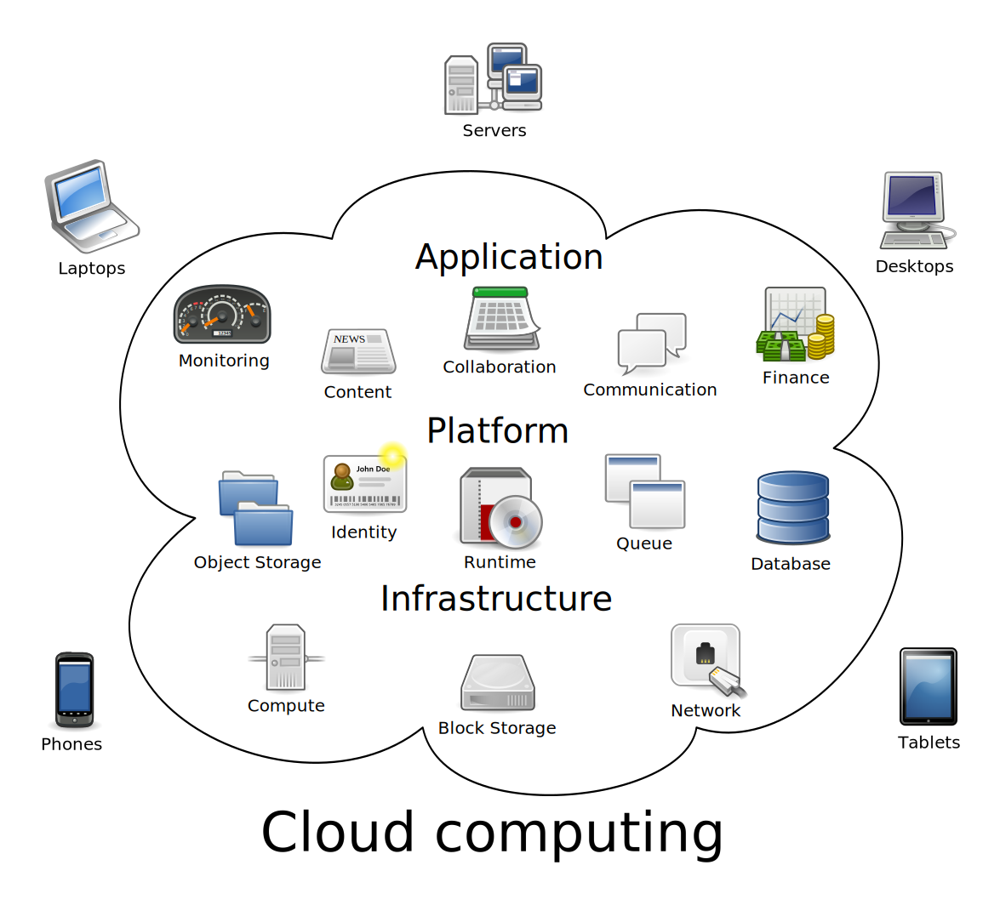

<!-- https://www.techlib.cz/cs/83581-cloudove-technologie -->

<!-- .slide: data-background="general-assets/cloud/intro.jpg" -->

<h1 style="color: black;">Cloudové technologie</h1>

<h2 style="color: black;">jejich možnosti a využití</h2>

<h3 style="color: black;">Ondřej Profant</h3>

----

# Ondřej Profant

- odborník na svobodný software
- člen komise ICT RHMP

---

# Obsah

1. Úvod (10 m)
1. Definice a princip (30 m)
2. Právní otázky (15 m)
3. Bezpečnost (15 m)
4. Přehled služeb (15 m)
  - mail
  - uložiště
  - služby (psaní, tabulky, účetnictví)
5. Přestávka (15 m)
6. Praktické ukázky

---

# Příprava

- internetový prohlížeč
- účty (Seznam, Google)
- zařízení (mobily, tablety)

---

# Definice a princip 1

**Buzz word**: přespříliš popularizovaný pojem

**Cloud**: Sdílený *black box* (černá skříňka)

**Cloud computing**: Sdílení výpočetního výkonu

**Cloud services**: Sdílení bezúdržbových služeb

----

----

# Definice a princip 2

**SaaS**: Service as a Service

service = konkrétní služba

**PaaS**: Platform as a Service

platform = prostředí

**IaaS**: Infrastructure as a Service

infrastructure = hardware

----

----

# Pozitiva

- Nemusíte nic instalovat
- Aktualizované / udržované
- Přístupné odkudkoliv
- Multiplatformní
- Sdílené

----

# Negativa

- Potřebujete připojení k Internetu
- Závislost na poskytovali řešení
- Potencionálně nižší výkon
- Nižší uživatelský komfort (oproti dobré aplikaci)

---

# Právní otázky 1

- služby poskytované zdarma
- mezinárodní poskytovatelé
- škody

----

# Pravní otázky 2

## Služby poskytované zdarma

- potvrzení smluvních podmínek
- většinou bez záruky

----

# Pravní otázky 3

## Mezinárodní poskytovatelé

- nemusí se řídit podle práva ČR
- ale nemusí se řídit ani podle práva původu!
  - firma z USA se nemusí řídit tamnějším právním řádem
- vymáhání práv je obtížné i když na ně máte nárok

----

# Pravní otázky 4

## Škody

- je obtížné dostat se zpátky k datům
- škoda je dosti imiginární
- většinou však problém nenastává
  - kdo z vás pravidelně zálohuje?

---

# Bezpečnost

- Vaše data jsou u cizí osoby!
- [Agresivita reklamy](http://www.piratskelisty.cz/clanek-1317-skryt-pred-reklamnimi-giganty-tehotenstvi-znamena-vypadat-jako-zlocinec)

Obrana:

- Dvoufaktorová autentizace
- Šifrování dat

---

# Přehled služeb

Co vše můžeme použít:

- e-mail
- blog (deník, sloupky)
- kancelářský balík
- malování
- profesionální aplikace
- ...

---

<!-- .slide: data-background="general-assets/questions.jpg" -->

# Otázky?

Prostor pro vaše dotazy

---

# Praktické ukázky

----

## Mail

Mnoho možností.

http://seznam.cz

https://gmail.com

(Seznam, Google účet)

----

## Kalendář

https://calendar.google.com

(Google účet)

----

## Uložiště

Mnoho možností

https://demo.nextcloud.com

https://drive.google.com

(Bez registrace)

----

## EtherPad

Sdílený poznámkový blok

https://pad.openalt.org

(Bez registrace)

----

## EtherCalc

Sdílená tabulka

https://ethercalc.org

(Bez registrace)

----

## Google Doc

Kompletní office: psaní, tabulky, prezentace, kreslení

https://drive.google.com

(Google účet)

----

## Google apps

Office, uložiště, mail, kontakty a kalendář.

(Google účet)

----

## Úkolovník

Seznamy úkolů, řízení projektů.

https://trello.com

(Google účet)

----

## Fakturování

Vystavování, evidence faktur

https://www.fakturoid.cz

(Registrace)

----

## RollApp

Kompletní sada aplikací.

https://www.rollapp.com

(Bez registrace)

----

## Hry

Ano, můžeme hrát i hry v cloudu.

http://playdosgamesonline.com
