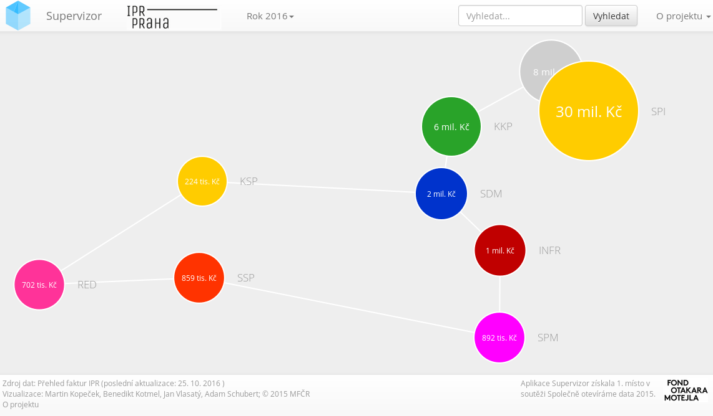
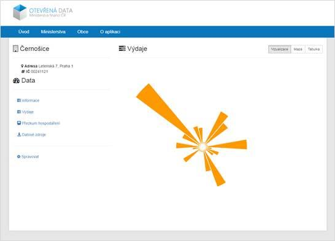
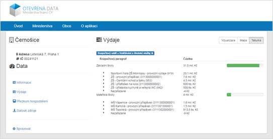
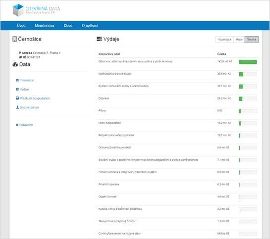

<!--
$theme: Gaia
page_number: true
footer: Otevřená města, Ondřej Profant
*page_number: false
*footer: .
-->

# Otevřená města

#### 5\. listopad 2016

#### OpenAlt

---

#### Ondřej Profant

- člen Výboru Otevřených měst
- člen komise ICT hl. m. Prahy
- opoziční zastupitel hl. m. Prahy
- Pirátská strana

---

## Problémy

- Zákon o veřejných zakázkách ([137/2006](http://www.zakonyprolidi.cz/cs/2006-137))
- Operativa provozu
	- Neflexibilní
	- Konzervativní
- Strach se změny
	- "Dělali jsme to tak vždycky."
	- Jednoduše neumějí
- Lobbování
	- Nejen negativní

---

## Otevřená města - myšlenka

Jsou organizací, která zastřešuje:

- **spolupráci**
- informovanost 
- transparentnost

---

### Spolupráce

- zapojení vývojářů
- zapojení občanů
	- obce neumí sbírat zpětnou vazbu

---

### Informovanost 

- pravidelné zveřejňování informací
  - opendata
  - kvalitní web
- vstřícný přístup k občanům

---

### Transparentnost

- průhledné veřejné zakázky
  - od přípravy záměru až do odevzdání výsledku
- používání moderních a otevřených technologií ve veřejné správě

---

## Projekty

- quick wins
- univerzální

---

## Projekty

- sdílení know-how (soutěž o návrh v IT)
- Registr smluv 2.0
- Podpora nákupu
- (Supervizor)
- (Supervizor Plus)

---

## Podpora nákupu

1. Záměr
2. Schválení
3. Soutěžení
4. Uzavření smlouvy (dodatky)
5. Rozpočtování (meziroční)
6. SLA?

---

## [Supervizor](https://github.com/SmallhillCZ/Supervizor)

---

## Supervizor

- 1\. místo v soutěži Společně otevíráme data 2015
- Nevytvořili Otevřená města
- [Github](https://github.com/SmallhillCZ/Supervizor)
- [Ministerstva](http://data.mfcr.cz/supervizor/)
- [Praha](https://supervizor.iprpraha.cz/)

---

## [Supervizor Plus](https://github.com/SmallhillCZ/)

---
## Supervizor Plus

---
## Supervizor Plus

---

<!-- *template: invert -->

## Otázky?

Prostor pro vaše dotazy.

## Zdroje

Otevřená města:

[otevrenamesta.cz](http://www.otevrenamesta.cz) | [Github](http://github.com/otevrenamesta) | [Facebook](https://www.facebook.com/otevrenamesta)

Ostatní:

[Grygov a opensource](http://www.linuxexpres.cz/business/grygov-diky-open-source-vycniva-nad-okolim-obcane-profituji) | [at4am](https://at4am.eu)

Prezentace:

[Slideshare](http://www.slideshare.net/ondrejprofant/otevrena-msta) | [Github](https://github.com/Kedrigern/prezentace-cs)

