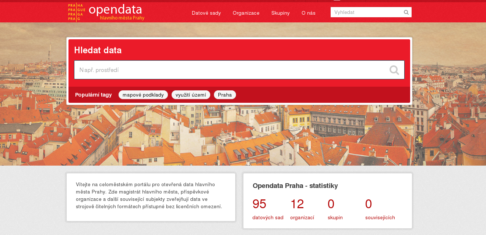
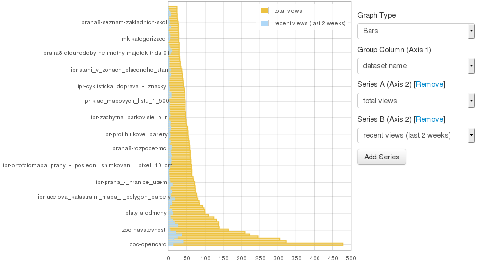
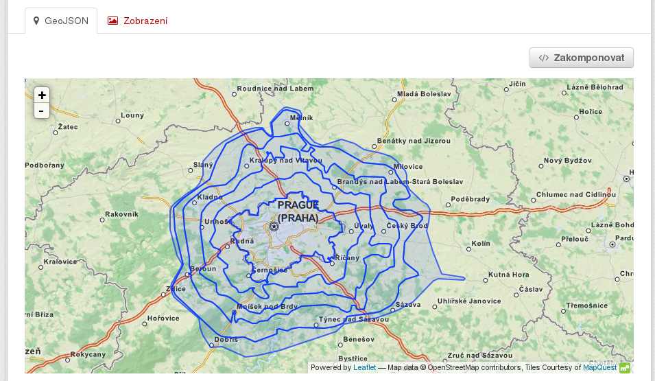

<!--Meta author:'Ondřej Profant' theme:'night' title:'OSS'-->

<!-- Čas: 16:30-17:30 Zadání:
Shrnutí zkušeností s řízením velkého IT provozu ve veřejné spravě. Od podvodů s licencemi až po reálné nasazení opensource. Co je největší problém při nasazování? Čeho se vyvarovat? Co naopak podpořit. Jak vypadají teze digitální strategie Prahy a jak vznikaly?
-->

# OSS ve veřejné správě

#### Ondřej Profant

- člen komise ICT hl. m. Prahy
- opoziční zastupitel hl. m. Prahy
- Pirátská strana

7\. listopad 2015

---

# Výchozí stav

- Vendor lock-in
- Neprofesionalita
- Neochota
- Dodavatelé jsou proti

----

## Příklad: licence

Podvod s licencemi velkých vendorů.

Víte jak to udělat v rámci korporátních pravidel?

> Reuse fee <!-- .element class="fragment" -->

----

## Příklad: ISKŘ

Informační systém krizového řízení.

**Měl by** zajišťovat koordinaci složek IZS v případě krize (pád letadla, požár, povodeň, ...). 

----

## Operátor Opencard a.s.

- 1 IT pracovník <!-- .element class="fragment" -->
- plnění úkolů
- peripetie s DB

----

## Trade center Praha

Co dělá?

Správa paláců <!-- .element class="fragment" -->

Proč tedy dělalo IT? <!-- .element class="fragment" -->

---

# Řešení

Co s tím?

----

## Řešení: Software

### Infrastruktura

- OS: Linux, BSD, ...
- Virtualizace: KVM, Docker, ...
- IdM: MidPoint
- Monitorování: Zabbix
- DMS: Alfresco
- CRM: Redmine, HESK, ...
- Webserver: Nginx, Apache
- Antispam: SpamAssasin
- OpenData: DKAN, CKAN
- Web: WordPress, Drupal, Liferay, ...

----

## Řešení: Software

### Koncové

- OS: Linux
- www: Mozilla Firefox, Google Chrome
- email: RoundCube, Mozilla Thunderbird, Zindus
- office: LibreOffice
- ostatní: 7zip
- specializované:
  - [AT4AM](http://www.at4m.eu): tvorba a připomínkování legislativy
  - AIS: sms informační systém

----

## Řešení: Vlastní tým

- povedlo se na NTK
- využívají: RHEL, CentOS, KVM, Zabbix, Redmine, PostgreSQL, Puppet, OpenVPN, OpenLDAP, ...
- tým:
  - Projektové vedení: 1 úvazek
  - L1 support: 6 úvazků
  - L2 support + interní vývoj: 5,5 úvazku (4 Red Hat Certified Engineer)
- velmi složité a nejisté řešení

---

## Praxe: Teze digitální strategie

- Inspirace: [Government Digital Service: Design Principles](https://www.gov.uk/design-principles)
- Autoři: Ondřej Felix, Jakub Michálek, Ondřej Profant a Josef Šlerka
- Rozdělení [Tezí digitální strategie](http://zastupitelstvo.praha.eu/ina2010/tedusndetail.aspx?id=252412):
 - Infrastruktura
 - Občan
 - Otevřené město
- Rozsah: 1,5 A4

----

----

## Praxe: Teze digitální strategie

### Infrastruktura

- Jedno město, jedno IT
- Mysli město, jednej v městské části
- Přístupnost rozhraní
- Ochrana dat

----

## Praxe: Teze digitální strategie

### Občan

- Jednou a na jednom místě
- Digitální řešení má přednost
- Praha je na netu tam, kde jsou její občané
- Občan, pak turista

----

## Praxe: Teze digitální strategie

### Otevřené město

- Open Data jsou nová ropa
- Open Source
- Otevřená soutěž mezi dodavateli

----

## Praxe: Opendata

[opendata.praha.eu](http://opendata.praha.eu)

----

----

----

----

----

----

----

----

### Vše je opensource!

Včetně implementace, úpravy tlačíme do upstreamu.

[**opendata.praha.eu**](http://opendata.praha.eu)

---

<!-- .slide: data-background="questions.jpg" -->

## Otázky?

Prostor pro vaše dotazy.

## Zdroje

Celopražská opendata:

[opendata.praha.eu](http://opendata.praha.eu)

Ostatní:

[Grygov a opensource](http://www.linuxexpres.cz/business/grygov-diky-open-source-vycniva-nad-okolim-obcane-profituji) | [at4am](https://at4am.eu)

Prezentace:

[Slideshare](http://www.slideshare.net/ondrejprofant/) | [Github](https://github.com/Kedrigern/prezentace-cs)

