<!--Meta author:'Ondřej Profant' theme:'night' title:'Celopražská otevřená data'-->

<!-- 
- 1 IT pracovník <!-- .element class="fragment" 
-->

# Celopražská opendata

#### Ondřej Profant

- člen komise ICT hl. m. Prahy
- opoziční zastupitel hl. m. Prahy
- Pirátská strana

16\. květen 2016

---

## Praxe: Teze digitální strategie

- Inspirace: [Government Digital Service: Design Principles](https://www.gov.uk/design-principles)
- Autoři: Ondřej Felix, Jakub Michálek, Ondřej Profant a Josef Šlerka
- Rozdělení [Tezí digitální strategie](http://zastupitelstvo.praha.eu/ina2010/tedusndetail.aspx?id=252412):
 - Infrastruktura
 - Občan
 - Otevřené město
- Rozsah: 1,5 A4

----

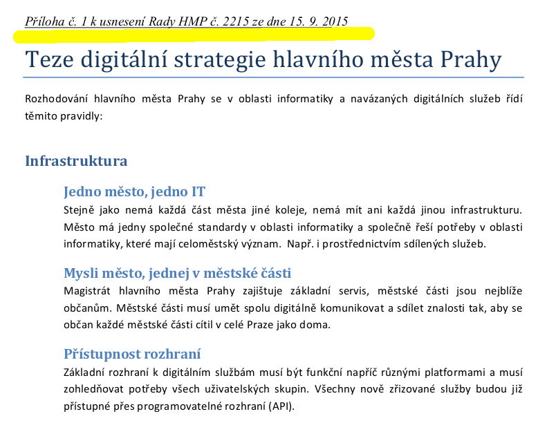

----

## Teze digitální strategie

### Infrastruktura

- Jedno město, jedno IT
- Mysli město, jednej v městské části
- Přístupnost rozhraní
- Ochrana dat

----

## Teze digitální strategie

### Občan

- Jednou a na jednom místě
- Digitální řešení má přednost
- Praha je na netu tam, kde jsou její občané
- Občan, pak turista

----

## Teze digitální strategie

### Otevřené město

- Open Data jsou nová ropa
- Open Source
- Otevřená soutěž mezi dodavateli

---

## Celopražská OpenData

| #       |                           |
|--------:|---------------------------|
|      13 | organizací                |
|      19 | datových formát           |
|     156 | datových sad              |
|   1 000 | zvířat z pražské ZOO      |
|   7 110 | evidovaného majetku       |
|   8 463 | faktur z městkých části   |
| 497 609 | výpujček z MK (1998-2015) |

Čísla jsou stav k 16. 5.

----

### Organizace

- pilotní provoz
- dobrovolné zapojení
- zapojeno:
	- 5 městských části (P5, P6, P7, P8, P21)
	- nejaktivnějším partnerem Institut plánování a rozvoje (IPR)
	- dalšími: DPP, TSK, ZOO, Městská knihovna, Operátor ICT
- odpovědnost:
	- provoz: magistrát (technické řešení)
	- koordinace: magistrát
	- správa: decentralizovaná (MČ mají vlastní směrnice dle opendata.gov.cz)

----

### Datové formáty

- 19 druhů
- v současnosti pouze doporučujeme
- příklady 
	- geodata: shp, gml, dxf, geoJSON, tfw, tiff
	- statická: csv, xlsx, xml
	- dynamická: rss (odkaz)
	- speciální: gtfs
	- ...
- geodata máme ve dvou souřadnicových formátech (S-JTSK, WGS 84)

----

### Technicky

IS / CMS: [CKAN](http://ckan.org) od The Open Knowledge Foundation

Včetně implementace, úpravy zasíláme do upstreamu. Vývoj probíhá na [Githubu](http://github.com).

[**opendata.praha.eu**](http://opendata.praha.eu)

---

## Jak to vypadá?

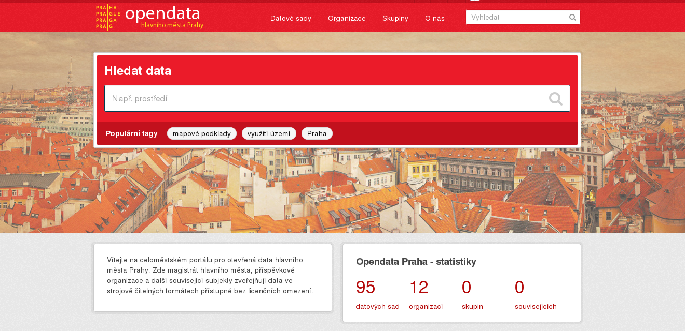

[opendata.praha.eu](http://opendata.praha.eu)

----

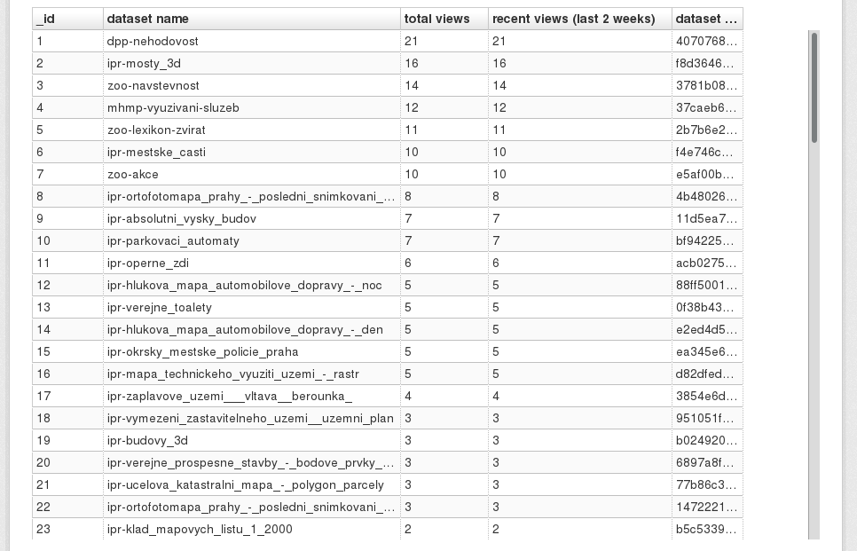

<small>[Odkaz](http://opendata.praha.eu/dataset/mhmp-vyuzivani-sluzeb/resource/4e1c5c07-907d-455f-ac0d-f3fe480e7742?view_id=4a2e0207-fb33-45b0-833f-49ed8441be2d)</small>

----

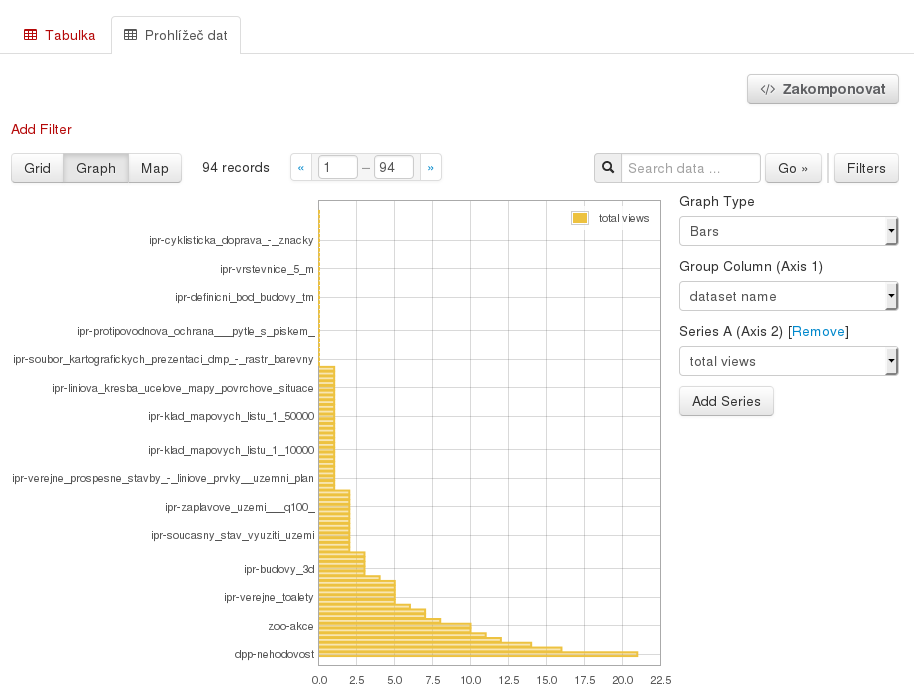

<small>Návštěvnost datasetů, [odkaz](http://opendata.praha.eu/dataset/mhmp-vyuzivani-sluzeb/resource/4e1c5c07-907d-455f-ac0d-f3fe480e7742)</small>

----

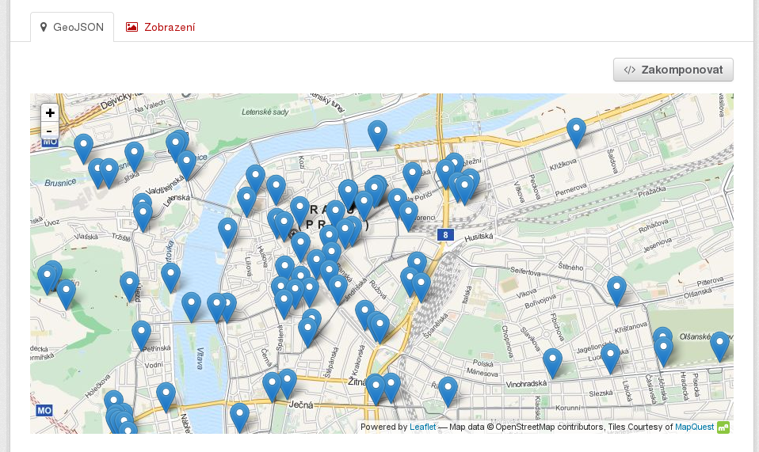

<small>Veřejné toalety, [odkaz](http://opendata.praha.eu/dataset/ipr-verejne_toalety/resource/a1755dce-bb8f-47f0-9894-ae2b5555cfc1)</small>

----

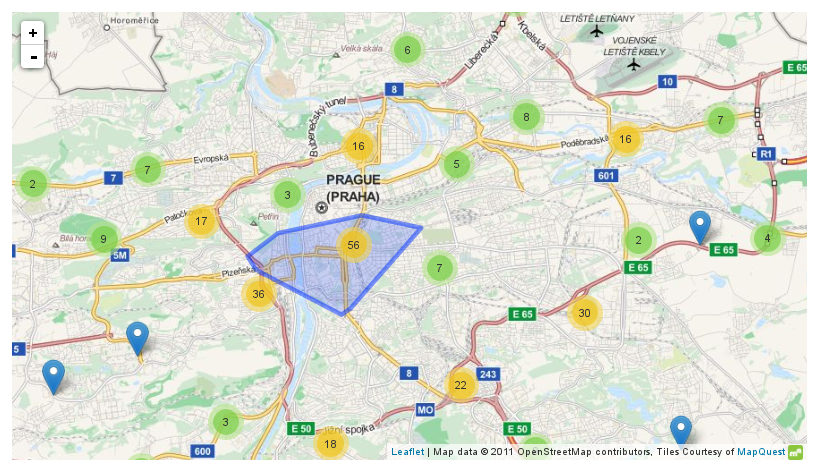

<small>[odkaz](http://opendata.praha.eu/dataset/kamery/resource/e99f2bfe-3951-4332-a8de-e76169ebf07e?view_id=318c8dd7-9d31-4377-8d55-3f6b70a45e1f)</small>

----

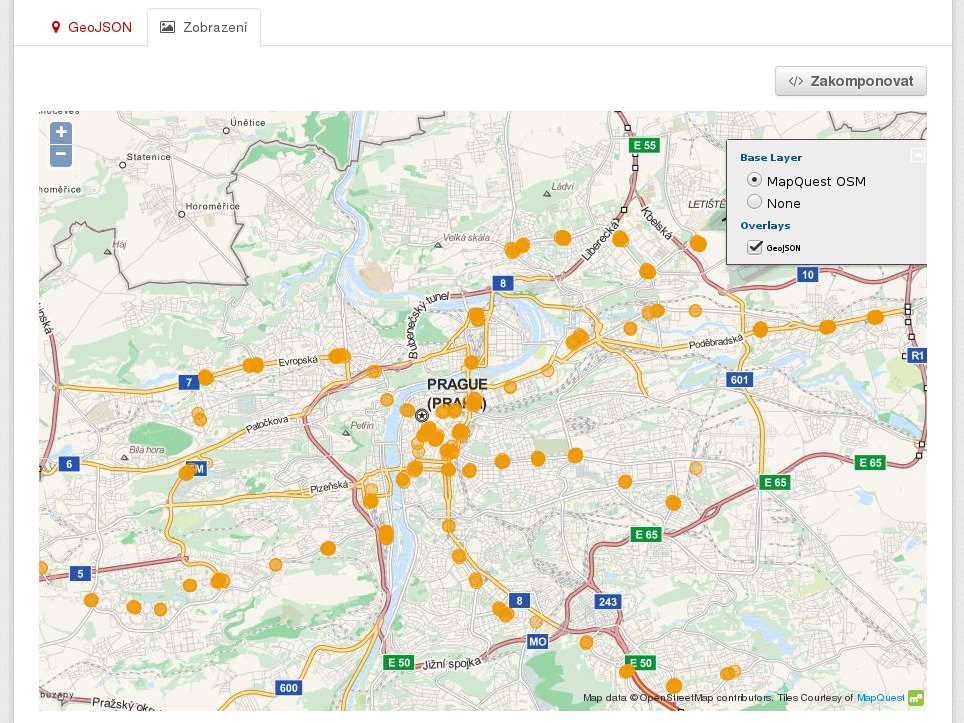

<small>Výstupy z metra, [odkaz](http://opendata.praha.eu/dataset/ipr-vstupy_pid/resource/bec8a26c-0dfa-47f7-a954-6df99d6e3e77)</small>

----

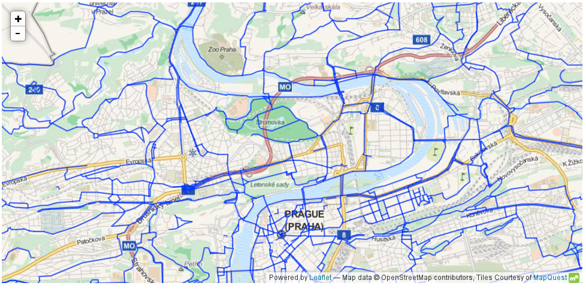

<small>Cyklistické trasy, [odkaz](http://opendata.praha.eu/dataset/ipr-cyklisticke_trasy/resource/dc1aac1d-cf4a-475e-9f98-052fc53d10b5)</small>

----

<small>Zóny placeného stání, [odkaz](http://opendata.praha.eu/dataset/ipr-stani_v_zonach_placeneho_stani/resource/c2f35cd0-eff2-41c8-928b-d5c257401fb2)</small>

----

<small>Okrsky městské policie, [odkaz](http://opendata.praha.eu/dataset/ipr-okrsky_mestske_policie_praha/resource/64b7cc2f-3071-4b48-99da-c0da552b4fb6?view_id=ff88c869-7919-4036-ab33-0ba620700c85)</small>

----

<small>Tarifní pásma PID, [odkaz](http://opendata.praha.eu/dataset/ipr-tarifni_pasma_pid/resource/2e53bf52-eaa0-4f1f-bca0-cdf6b8714a99)</small>

----

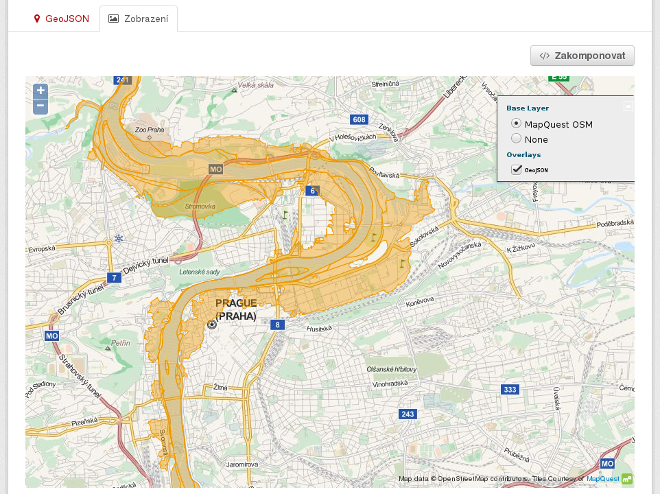

<small>Záplavová území, [odkaz](http://opendata.praha.eu/dataset/ipr-zaplavove_uzemi___vltava__berounka_/resource/1b137a02-7ae7-4a34-80c6-f727ba313c73?view_id=a97e768e-a58b-4dc8-8228-80740269a596)</small>

---

## Co dál?

**Aplikace!**

Skvělým příkladem je supervizor MF ČR:

http://data.mfcr.cz/supervizor/

----

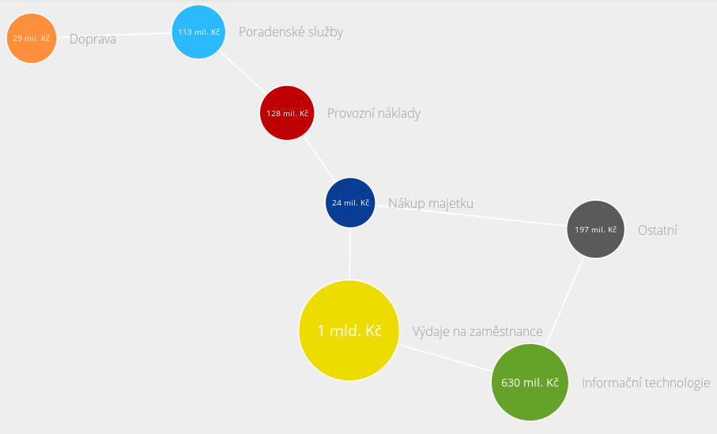

----

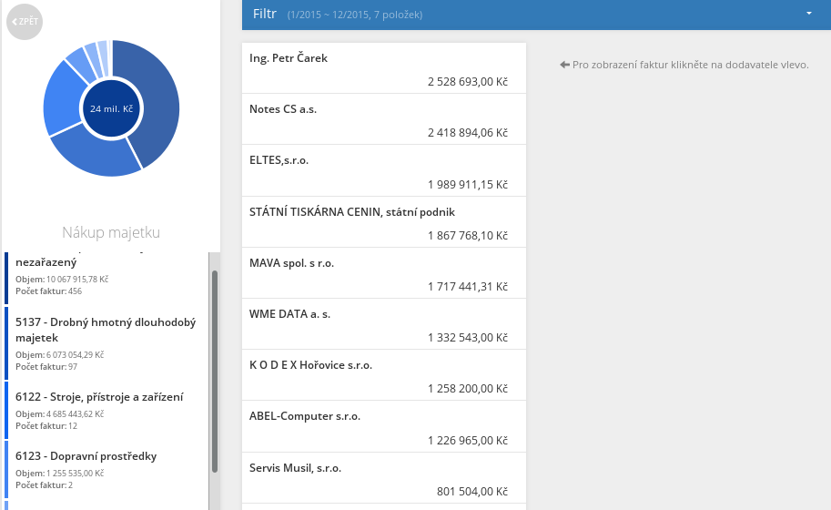

----

### Možnosti

Spolupracujeme se studenty ze ČVUTu.

Data propagujeme na hackatonech.

Komunikujeme i s komerčními subjekty. Např. Seznam.cz má o data zájem.

---

<!-- .slide: data-background="general-assets/questions.jpg" -->

## Otázky?

Prostor pro vaše dotazy.

## Zdroje

Celopražská opendata:

[opendata.praha.eu](http://opendata.praha.eu)

Prezentace:

[Slideshare](http://www.slideshare.net/ondrejprofant/) | [Github](https://github.com/Kedrigern/prezentace-cs)

