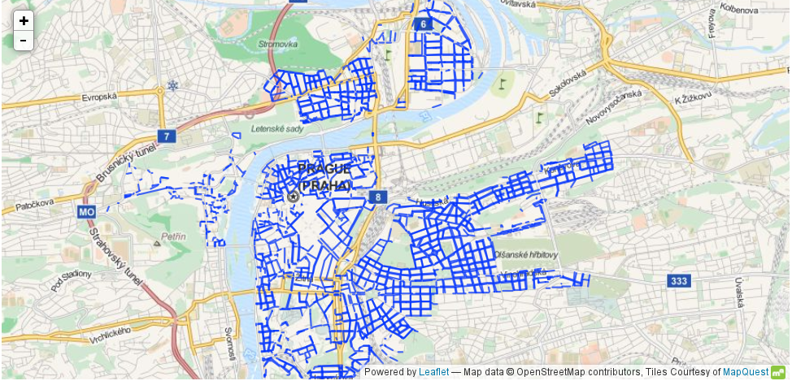

<!--Meta author:'Ondřej Profant' theme:'night' title:'Celopražská otevřená data'-->

<!-- Čas: 23. 3. 2016 11:00-17:30 Zadání:

- 1 IT pracovník <!-- .element class="fragment" -->

# Celopražská opendata

#### Ondřej Profant

- člen komise ICT hl. m. Prahy
- opoziční zastupitel hl. m. Prahy
- Pirátská strana

21\. březen 2016

---

## Praxe: Teze digitální strategie

- Inspirace: [Government Digital Service: Design Principles](https://www.gov.uk/design-principles)
- Autoři: Ondřej Felix, Jakub Michálek, Ondřej Profant a Josef Šlerka
- Rozdělení [Tezí digitální strategie](http://zastupitelstvo.praha.eu/ina2010/tedusndetail.aspx?id=252412):
 - Infrastruktura
 - Občan
 - Otevřené město
- Rozsah: 1,5 A4

----

----

## Teze digitální strategie

### Infrastruktura

- Jedno město, jedno IT
- Mysli město, jednej v městské části
- Přístupnost rozhraní
- Ochrana dat

----

## Teze digitální strategie

### Občan

- Jednou a na jednom místě
- Digitální řešení má přednost
- Praha je na netu tam, kde jsou její občané
- Občan, pak turista

----

## Teze digitální strategie

### Otevřené město

- Open Data jsou nová ropa
- Open Source
- Otevřená soutěž mezi dodavateli

---

## Celopražská OpenData

| #       |                           |
|--------:|---------------------------|
|      13 | organizací                |
|     129 | datových sad              |
|   1 000 | zvířat z pražské ZOO      |
|   7 110 | evidovaného majetku       |
|   8 463 | faktur z městkých části   |
| 497 609 | výpujček z MK (1998-2015) |

----

### Organizace

- dobrovolné zapojení
- pilotní provoz
- nejkativnějším partnerem Institut plánování a rozvoje (IPR)
- zapojeno 5 městských části (P5, P6, P7, P8, P21)

----

### Technicky

IS / CMS: [CKAN](http://ckan.org) od The Open Knowledge Foundation

Včetně implementace, úpravy zasíláme do upstreamu. Vývoj probíhá na [Githubu](http://github.com).

[**opendata.praha.eu**](http://opendata.praha.eu)

---

## Jak to vypadá?

[opendata.praha.eu](http://opendata.praha.eu)

----

<small>[Odkaz](http://opendata.praha.eu/dataset/mhmp-vyuzivani-sluzeb/resource/4e1c5c07-907d-455f-ac0d-f3fe480e7742?view_id=4a2e0207-fb33-45b0-833f-49ed8441be2d)</small>

----

<small>[Odkaz](http://opendata.praha.eu/dataset/mhmp-vyuzivani-sluzeb/resource/4e1c5c07-907d-455f-ac0d-f3fe480e7742)</small>

----

----

----

<small>[Odkaz](http://opendata.praha.eu/dataset/ipr-vstupy_pid/resource/bec8a26c-0dfa-47f7-a954-6df99d6e3e77)</small>

----

<small>Cyklistické trasy, [odkaz](http://opendata.praha.eu/dataset/ipr-cyklisticke_trasy/resource/dc1aac1d-cf4a-475e-9f98-052fc53d10b5)</small>

----

<small>Zóny placeného stání, [odkaz](http://opendata.praha.eu/dataset/ipr-stani_v_zonach_placeneho_stani/resource/c2f35cd0-eff2-41c8-928b-d5c257401fb2)</small>

----

<small>Okrsky městské policie, [odkaz](http://opendata.praha.eu/dataset/ipr-okrsky_mestske_policie_praha/resource/64b7cc2f-3071-4b48-99da-c0da552b4fb6?view_id=ff88c869-7919-4036-ab33-0ba620700c85)</small>

----

<small>Tarifní pásma PID, [odkaz](http://opendata.praha.eu/dataset/ipr-tarifni_pasma_pid/resource/2e53bf52-eaa0-4f1f-bca0-cdf6b8714a99)</small>

----

---

## Co dál?

**Aplikace!**

Skvělým příkladem je supervizor MF ČR:

http://data.mfcr.cz/supervizor/

----

----

---

<!-- .slide: data-background="general-assets/questions.jpg" -->

## Otázky?

Prostor pro vaše dotazy.

## Zdroje

Celopražská opendata:

[opendata.praha.eu](http://opendata.praha.eu)

Prezentace:

[Slideshare](http://www.slideshare.net/ondrejprofant/) | [Github](https://github.com/Kedrigern/prezentace-cs)

