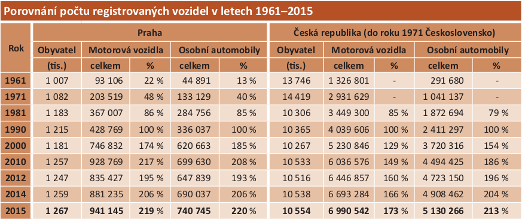
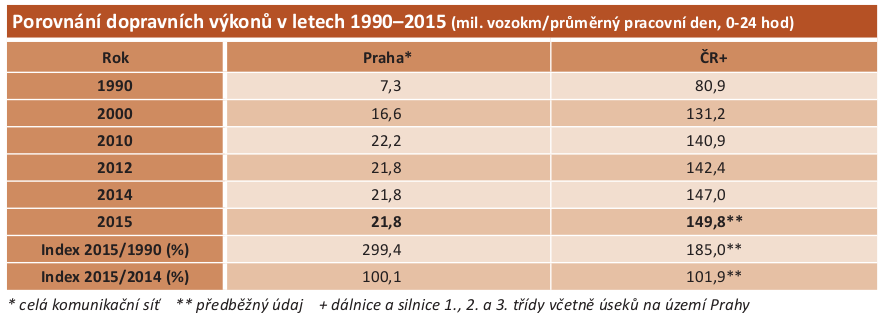
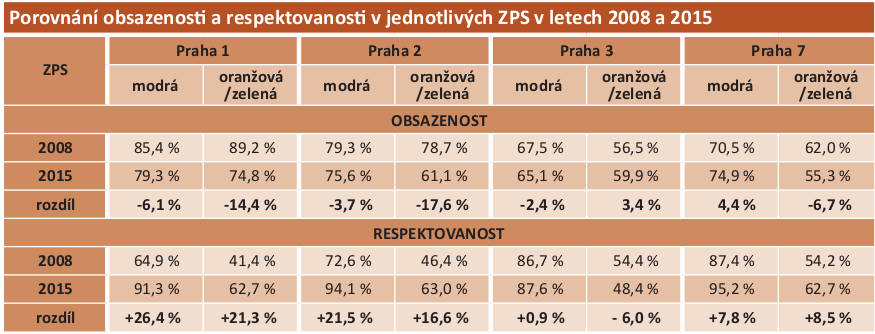
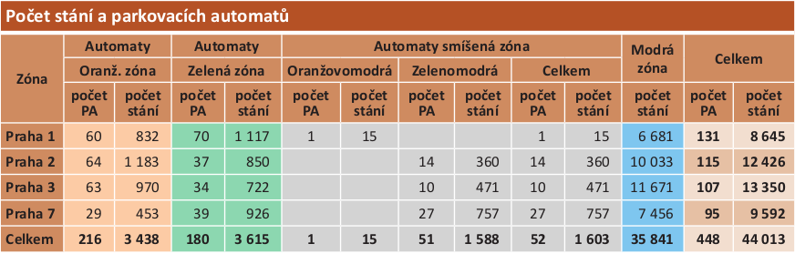

# Parkování v Praze

## Ondřej Profant

zastupitel Hl. m. Prahy

---

# Fakta

1\. část prezentace obsahuje základní východiska.

----

## Historie zavádění zón

| Rok  | Městská část  |
|------|---------------|
| 1996 | Praha 1       |
| 2007 | Praha 2       |
| 2008 | Praha 3, 7    |
| 2016 | Praha 5, 6, 8 |

Historicky již za minulého režimu.

----

## Typy - staré

|              |              |
|--------------|--------------|
| **Modrá**    | rezident     |
| **Oranžová** | do 2 hodin   |
| **Zelená**   | do 6 hodin   |

----

## Typy - nové

|              |                   |
|--------------|-------------------|
| **Fialová**  | smíšená zóna: přes den zde mohou kromě rezidentů zaparkovat i další řidiči, stání je placené |
| **Oranžová** | návštěvnická zóna: placené stání s dobou omezenou na 2 hodiny, navrženo ke zdravotním střediskům a úřadům |
| **Modrá**    | rezidentní zóna   |
| **Zelená**   | ekologická zóna: pouze pro ekologické vozy a vozy v systému carsharingu |

----

- Výrazně přibývá středočechů
- Pražský zastupitel nemá motivaci starat se o středočechy
- Lidé chtějí parkovat před domem, protože
	- je to blízko
	- bezpečnost (dohled)

----

----

----

----

---

## Základní problémy

- Nedostatek P+R
	- 16 parkovišť
	- 3009 par. stání
- Platby za parkování neodpovídají tržní ceně
	-  1 200 Kč/rok resident 1. auto
	- 12 000 Kč/rok resident 2. atuo
- Chybí volné přenosné hodiny
- Moc typů zón (zelená)
- Nepohodlné (složité zaplatit)
	- zlepšilo
- Není zde tržní princip
- Špatné vymezení dob

----

## Další problémy

- Nejednotnost systému
	- Roztříštěnost správců
- Nedostatečné informování (rezidentů, turistů)
	- Kolik pražánů ví, co je fialová zon?

---

# Co s tím?

----

## Platby

- jednotné
- typy
	- kartou (bezkontaktní)
	- mobilem
	- skrz účet pražana

----

## Návrh 1

1. Jeden typ zóny 
2. Rezident dostává rezidenční pro KÚ 
3. Rozlišujeme zda povolujeme krátkodobé či dlouhodobé
4. Různé ceny
	- rezident 1200 Kč / ročně
	- krátkodobé (do 2 h): 50 Kč / h
	- střednědobé: 30 Kč / h 
	- dlouhodobé 4000 Kč / měsíčně
5. Zastropování střednědobé ceny (denní)

*Ceny jsou orientační.*

----

## Návrh 1 - varianta 2

- ceny krátkodobého a střednědobého určuje trh (v rámci mezí)
	- dlouhodobě se měří poptávka po dané oblasti
	- cena je v daném rozsahu a určuje se dle dlouhodobé poptávky
- popřípadě i varinta s dynamickým placením pro rezidenta

----

## Návrh 1 - varianta 3

- rezident automaticky dostává zdarma své KÚ
- jsou centrální větší parkoviště 
	- kam může každý rezident
	- levnější sazba

----

## Návrh 1 - varianta 4

- kú se zaměňuje za celou MČ (jako je to dnes)

----

## Zlepšovací návrhy

- "K+R" pro rezidenty
- Tlak na přesun aut z ulic do parkovacích domů
- Zvýšit dobu bezplatného parkování (v současnosti 3 min)
- Nahradit MČ za seznam ulic (dle kružnice od bydliště)
- Udělat speciální značky (jednoduché emotikony ala CC)
- Snížit hodinovou sazbu / zastropovat (fialová zóna)

---

# Zdroje

Děkuji za pozornost.

Otázky?

- [prezentace](https://github.com/kedrigern/prezentace-cs/)
- [parkujvklidu.cz](http://www.parkujvklidu.cz/)
- [ročenka TSK](http://www.tsk-praha.cz/static/udi-rocenka-2015-cz.pdf)
- [envwiki](https://www.enviwiki.cz/wiki/Management_parkov%C3%A1n%C3%AD)
- [Michal Kašpárek](http://m.penize.cz/spotrebitel/316168-jak-zavest-bezproblemove-parkovani-a-nepodmineny-prijem-jednou-ranou#element_22_90311)
- [Jak fungují nové zóny?](http://mobil.idnes.cz/placeni-v-zonach-placeneho-stani-praha-dxs-/aplikace.aspx?c=A160823_192130_aplikace_jm)
