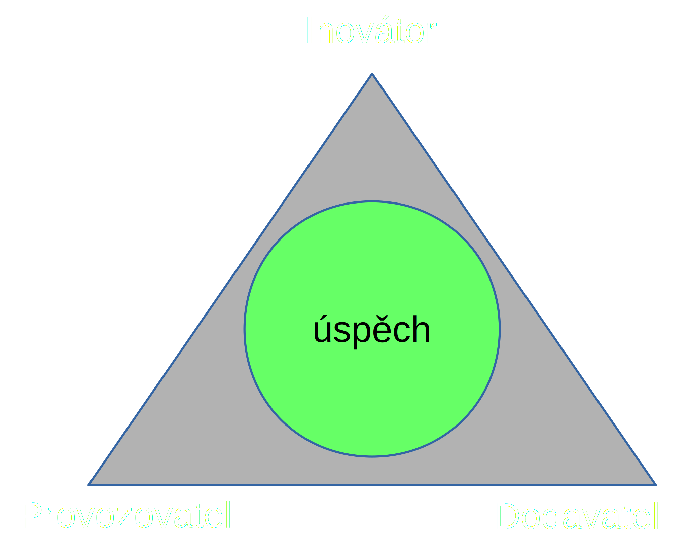

<!--Meta author:'Ondřej Profant' theme:'night' title:'Smart city'-->

<!-- Čas: 4. 4. 2016 09:15-09:35 Zadání:
-->

# Smart City 

# s rozumem

#### Ondřej Profant

- člen komise ICT hl. m. Prahy
- opoziční zastupitel hl. m. Prahy
- Pirátská strana

4\. duben 2016

---

## Co je to smart city?

> Smart City je místo, kde jsou efektivnější tradiční sítě a služby ve prospěch jeho obyvatel a podniků, díky použití digitálních a telekomunikačních technologii. 

– Smart City Brno

- přednáška bude o smart city, nikoliv smart grids
- buzz word ! <!-- .element class="fragment" -->
- příležitost utrácet !  <!-- .element class="fragment" -->

---

## Co k tomu potřebujeme?

- Provozovatel (město, příspěvkovka)
- Dodavatel (soukromá společnost)
- Inovátor (fyzická osoba)

----

### Projekt

-> Myšlenka ->  

-> Kritika ->  <!-- .element class="fragment" -->

-> Roadmap (plán) ->  <!-- .element class="fragment" -->

-> Milníky -> <!-- .element class="fragment" -->

-> Cíl <!-- .element class="fragment" -->

----

### Plán

- Total cost of ownership (TCO)
- Stakeholdery
- Srovnání možných variant

---

## Příklady

----

### Elektrobus

- Příklad z Prahy
- Elektrobus s docela slušným dojezdem se schopností dobíjet se s troleje (typicky v kopci)
- V čem je problém?
  - Prodávané modely jsou malé!  <!-- .element class="fragment" -->

----

### Inteligentní koše

- Obsahuje lis (zmenšení objemu)
- Hlasí když je plný
- V čem je problém?
  - 273 600 Kč / 4 roky pronájmu   <!-- .element class="fragment" -->
  - 248 500 Kč koupě (+instalace, zaruka jen 2 roky)  <!-- .element class="fragment" -->
  - [zdroj]()  <!-- .element class="fragment" -->

----

### Opendata

- Vezměme data (původní informace) a zveřejněme je
	- jízdní řády
	- statistiky (kriminalita)
	- povodňové mapy
- Nechme ostatní, aby byli chytří 
	- resp. nechme je nést riziko
	- nechme je inovovat

---

!

**Je třeba řešení dělat chytrá, ale nikoliv pod záštitou chytrosti**

!

---

<!-- .slide: data-background="general-assets/questions.jpg" -->

## Otázky?

Prostor pro vaše dotazy.

## Zdroje

* [Smart city v praxi](http://www.proelektrotechniky.cz/smart-city.php)
* [Smart City Brno](brno.cz/sprava-mesta/volene-organy-mesta/rada-mesta-brna/komise-rady-mesta-brna/smart-city-brno/)
* [Smart City Praha](iprpraha.cz/clanek/308/smart-cities/)

Prezentace:

[Slideshare](http://www.slideshare.net/ondrejprofant/) | [Github](https://github.com/Kedrigern/prezentace-cs)

